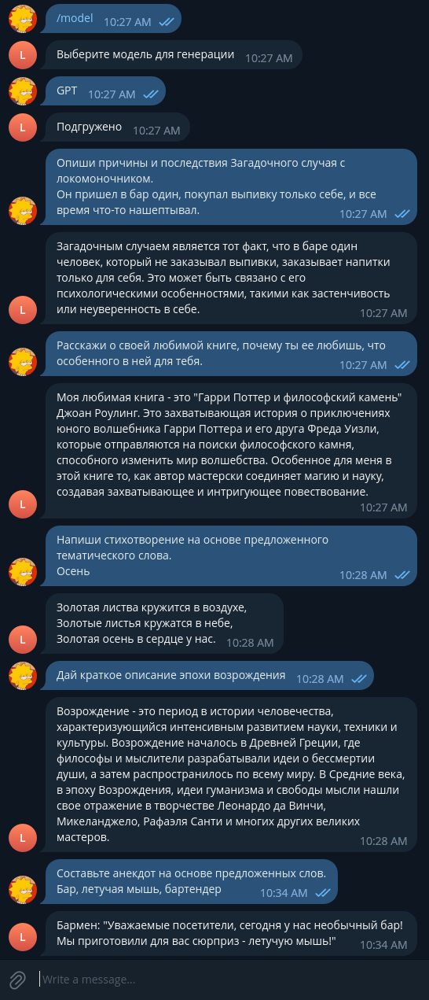
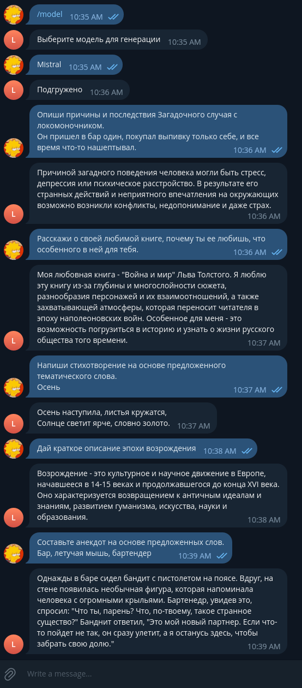
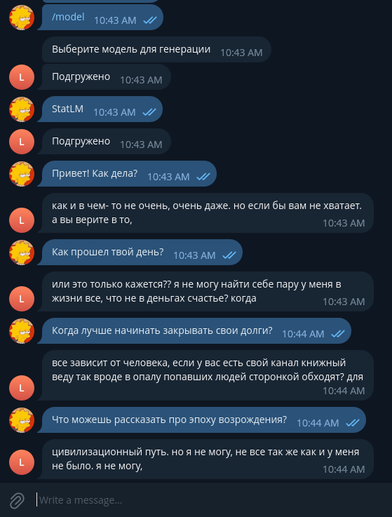

# mail_ru_llm_Nurmukhametov_Almir
# Telegram bot assistant project

## Веса моделей можно найти по [ссылке](https://drive.google.com/drive/folders/1kWuNNIbJRMgzrn3Ip_jS54pMkmEj7RVA?usp=sharing)
Для того, чтобы заработал весь функционал, архивы моделей необходимо распаковать в папку `models`.

## Простая модель на основе статистик встречаемости ngram
* `training_notebooks/stat_lm_training.ipynb` -- основной notebook по обучению модели.
* `Training Data`: для обучения использовался [датасет](https://huggingface.co/datasets/Den4ikAI/russian_dialogues) из диалогов собранных с Telegram чатов.

## GPT2 Model Trained Using QLoRA: LoRA (Low Rank Adaptation) and 4bit quantization
* `training_notebooks/rugptlarge_lm_qlora_training.ipynb` -- основной notebook по обучению модели
* `Training Data`: для обучения использовался из [датасет](https://huggingface.co/datasets/lksy/ru_instruct_gpt4) из инструкций, сгенерированных с помощью GPT4.

## Mistral 7b Model Trained Using QLoRA: LoRA (Low Rank Adaptation) and 4bit quantization
* `training_notebooks/mistral_7b_v0.1.ipynb` -- основной notebook по обучению модели
* `Training Data`: для обучения использовался из [датасет](https://huggingface.co/datasets/lksy/ru_instruct_gpt4) из инструкций, сгенерированных с помощью GPT4.

**Для корректного функционирования бота необходимо установить все пакеты из** `requirements.txt`:

**Бота можно запустить с помощью команды**:
```
python llm_assistant_bot.py
```

## Примеры работы бота
GPT2 Answers             |  Mistral Answers | Ngram Model
:-------------------------:|:-------------------------:|:-------------------------:
  |   | 
